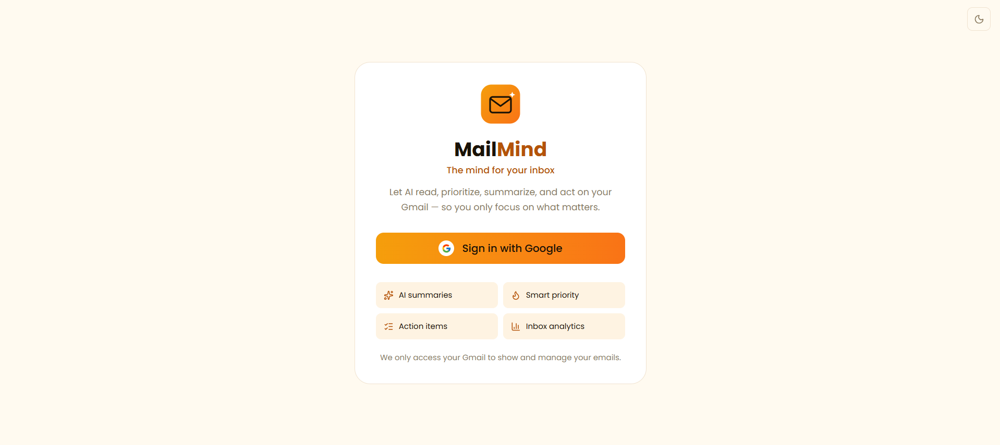
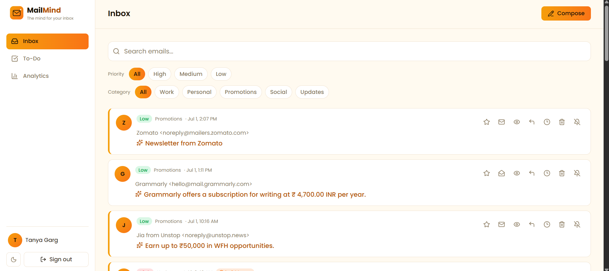
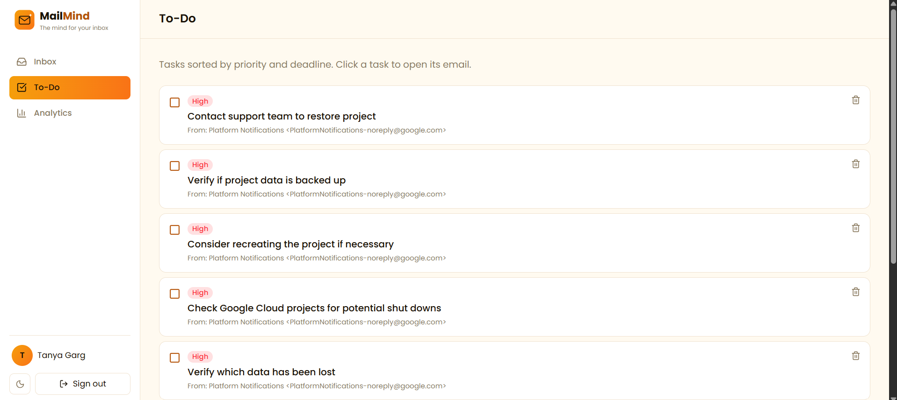
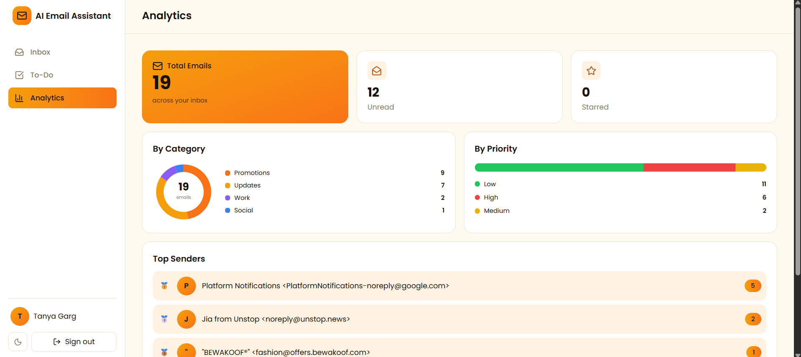

<h1>📬 AI Email Assistant</h1>

<h3>Your inbox, understood by AI.</h3>

Read, prioritize, summarize, and act on your Gmail — so you only focus on what matters.

  

  
  
  
  
  
  

<h2>✨ Overview</h2>

<b>AI Email Assistant</b> connects to your Gmail and uses AI to turn a chaotic inbox into an organized, actionable workspace. It doesn't just <i>show</i> your emails — it <b>understands</b> them: summarizing each one, flagging what's urgent, sorting them into categories, extracting your to-dos, and drafting replies for you.

🔗 <b>Live app →</b> <a href="https://ai-email-assistant-theta-two.vercel.app">ai-email-assistant-theta-two.vercel.app</a>

<h2>📸 Screenshots</h2>

<h3>🔐 Sign In</h3>

<h3>📥 Inbox — AI summaries, priority &amp; filters</h3>

<h3>✅ To-Do — tasks extracted from your emails</h3>

<h3>📊 Analytics — your inbox at a glance</h3>

<h2>🚀 Features</h2>

<ul>
  <li>🤖 <b>AI Summaries</b> — every email condensed into one clear sentence</li>
  <li>🔥 <b>Smart Priority</b> — auto-tags emails as High / Medium / Low</li>
  <li>🏷️ <b>Auto-Categorize</b> — Work, Personal, Promotions, Social, Updates</li>
  <li>⏰ <b>Deadline Detection</b> — finds due dates hidden inside emails</li>
  <li>✅ <b>Action Items → To-Do</b> — extracts tasks from every email into one checklist</li>
  <li>💬 <b>AI Reply Suggestions</b> — drafts a reply you can edit and send</li>
  <li>✉️ <b>Compose &amp; Send</b> — write brand-new emails from the app</li>
  <li>⭐ <b>Star / Read / Unread</b> — full inbox management, synced with Gmail</li>
  <li>💤 <b>Snooze</b> — hide an email and bring it back later</li>
  <li>🔕 <b>Unsubscribe Detector</b> — one-click unsubscribe from newsletters</li>
  <li>🔎 <b>Search &amp; Filter</b> — by keyword, priority, or category</li>
  <li>📊 <b>Analytics Dashboard</b> — inbox breakdown by category, priority &amp; top senders</li>
  <li>🌗 <b>Dark / Light Mode</b> — toggle-able amber theme</li>
</ul>

<h2>🛠️ Tech Stack</h2>

<table>
  <tr><td><b>Framework</b></td><td>Next.js (App Router) + React</td></tr>
  <tr><td><b>Styling</b></td><td>Tailwind CSS v4 + Lucide icons</td></tr>
  <tr><td><b>Auth</b></td><td>NextAuth.js (Google OAuth) with automatic token refresh</td></tr>
  <tr><td><b>Email</b></td><td>Gmail API (read, modify, send)</td></tr>
  <tr><td><b>AI</b></td><td>Groq (Llama 3.1) — summaries, priority, categories, action items &amp; replies</td></tr>
  <tr><td><b>Database</b></td><td>Neon (serverless PostgreSQL)</td></tr>
  <tr><td><b>Hosting</b></td><td>Vercel</td></tr>
</table>

<h2>⚙️ How It Works</h2>

<ol>
  <li><b>Sign in with Google</b> — the app securely requests access to your Gmail.</li>
  <li><b>Fetch &amp; analyze</b> — each new email is run through the AI in a single call that returns a summary, priority, deadline, category, and action items.</li>
  <li><b>Cache in Postgres</b> — results are stored so the inbox loads instantly and persists across sessions.</li>
  <li><b>Stay in sync</b> — the To-Do and Analytics pages read from the same database.</li>
</ol>

<h2>🏁 Getting Started</h2>

<pre><code>git clone https://github.com/Tanyaagarg/ai-email-assistant.git
cd ai-email-assistant
npm install
npm run dev
</code></pre>

Then open <b>http://localhost:3000</b>.

<h3>Environment Variables</h3>

Create a <code>.env.local</code> file in the project root:

<pre><code>NEXTAUTH_URL=http://localhost:3000
NEXTAUTH_SECRET=your_random_secret
GOOGLE_CLIENT_ID=your_google_client_id
GOOGLE_CLIENT_SECRET=your_google_client_secret
GROQ_API_KEY=your_groq_api_key
DATABASE_URL=your_neon_connection_string
</code></pre>

Then visit <code>http://localhost:3000/api/setup-db</code> once to create the database tables.

<h2>📂 Project Structure</h2>

<pre><code>app/
├── api/          # Backend routes (emails, auth, AI actions, analytics)
├── components/   # Shell (sidebar) + ThemeToggle
├── inbox/        # Main inbox page
├── todo/         # AI-generated task list
├── analytics/    # Charts & stats dashboard
├── login/        # Sign-in page
├── lib/          # auth, database & AI helpers
└── layout.js     # Root layout + theme setup
</code></pre>

<h2>👩‍💻 Author</h2>

<b>Tanya Garg</b> — <a href="https://github.com/Tanyaagarg">GitHub @Tanyaagarg</a>

  
⭐ <b>If you like this project, give it a star!</b> ⭐

